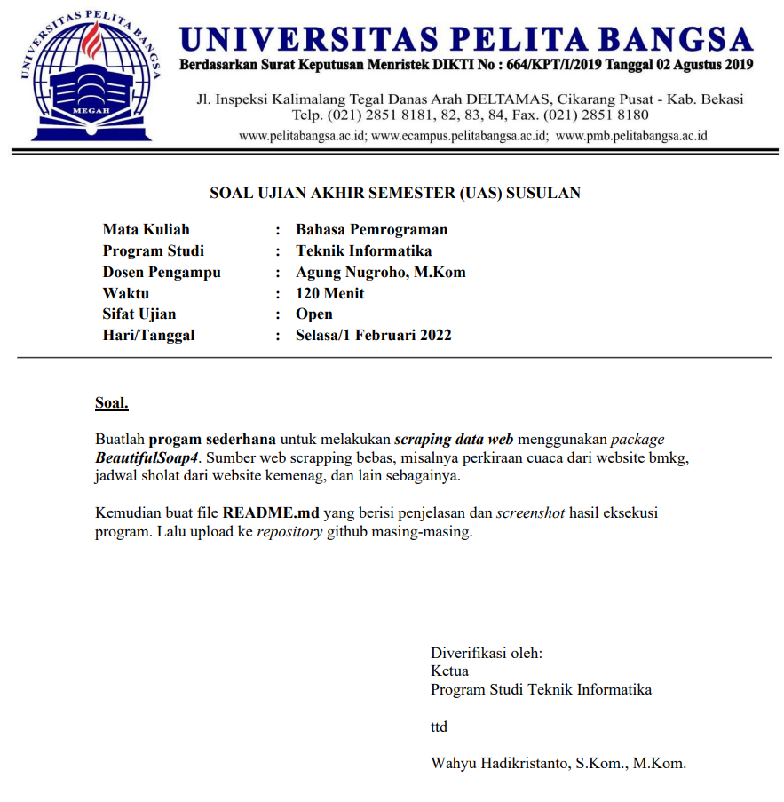
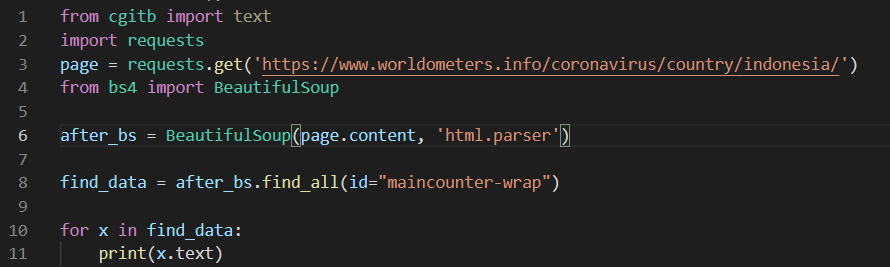
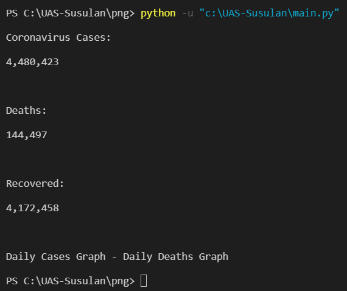

# UAS-Susulan



**Jawaban Serta penjelasan**

NNah jadi kita ambil dari web https://www.worldometers.info/coronavirus/country/indonesia/ dan mengambil id=”maincounter-wrap” untuk mendapatkan update data Covid 19. Lanjut ke scriptnya 
````py
    import requests
    page = requests.get('https://www.worldometers.info/coronavirus/country/indonesia/')
````

Request dilakukan untuk membuka web page yang akan kita scrap. Kemudian kita lanjut dengan BeautifulSoupnya

````py
    from bs4 import BeautifulSoup
    after_bs = BeautifulSoup(page.content, 'html.parser')
    print(page.content)
    find_data = after_bs.find(id="maincounter-wrap")
    print(find_data.prettify())
    print(find_data.text)
````

Prettify digunakan untuk menampilkan format HTML dari element (di case ini id=”maincounter-wrap”) dan find_data.text menampilkan ekstraksinya dalam bentuk text. Selajutnya karena ada 3 blok yang menggunakan id=”maincounter-wrap” kita akan gunakan dengan perulangan for untuk ektraksi datanya.

````py
    for x in find_data:
    print(x.text)
````
**Code**



**Output dari program yang saya buat**
